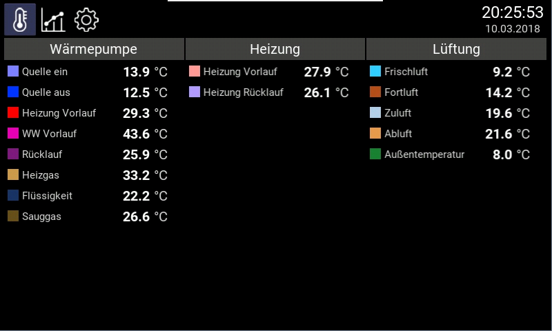
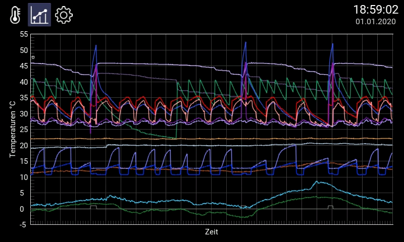

# Data Logger
Measure, display and log temperatures with Raspberry PI 3B.

This is a simple hobby project for logging temperatures of my heat pump and heating system. 
Feel free to use it in your own projects (Apache License Version 2.0).

It contains some icons from [Flaticon](https://www.flaticon.com/), license [Creative Commons BY 3.0](http://creativecommons.org/licenses/by/3.0/), see [CREDITS](CREDITS.html) for details.

## Features

### Current Temperatures
Show the current readings



### Temperature Graphs
Show how temperatures developed over the last 24 hours



### MQTT Client
Publish all temperature readings to a MQTT broker. This allows to track and show them in common MQTT apps.
The MQTT messages contain JSON with timestamp and value:

    { "status": "ok", "timestamp": "2020-11-13T17:08:57.753064", "value": 9.697, "unit": "°C", "formatted": "9.7" }

### CSV Logging
The temperature readings are written to CSV files and held for 32 days. This also allows to immediately re-fill the graphs view after restart.

## Hardware

- Raspberry PI 3B
- Official Raspberry PI 7" touch display, 800x480 (expensive, but well supported in Raspbian, multi-touch)
- Official Raspberry power supply 5.1V/2.5A with additional 330uF capacitor for stabilization (Raspi is quite picky here...)
- Heat sink on Raspberry CPU (... to avoid the random crashes that may occur otherwise)
- DS 18B20 temperature sensors (1-Wire bus allows many sensors at the same GPIO port, well supported in Raspbian)
- TSIC 306 temperature sensors (high accurracy, expensive, but already installed from a previous project)

## Platform

- Raspbian Buster
- Python 3.7
- UI toolkit Kivy (nice and simple UIs with multi-touch support)
- Charts with Kivy Garden Graph (fast drawing)
- TSIC temperature sensors: python module tsic (sensor reading based on pigpio)
- GPIO access: pigpio (IO with precise timing)

## Installation / Configuration

Steps last performed on latest Raspbian of 2021-01-23
```
# Install Raspbian buster to SD card,
# optionally create files "ssh" and "wpa_supplicant.conf" according to doc
# in boot partition for set-up without keybord and monitor before initial boot,
# boot Raspi and ssh to raspberrypi as user pi password raspberry,
# change user pi's password to a secure one!

# Desktop packages
sudo apt update
sudo api install lightdm lxsession 

# Basic config
sudo raspi-config
- set hostname
- set time zone
- enable VNC for remote access to desktop
- enable 1-Wire
- set boot to desktop with auto-login

# GPIO access for TSIC sensor support
sudo apt install pigpio
sudo systemctl enable pigpiod
sudo systemctl start pigpiod

# Data-logger and required packages
sudo apt install python3-pip
cd ~
git clone https://github.com/grillbaer/data-logger.git
cd data-logger
pip3 install -r requirements.txt

# Graphical UI Kivy 2.0.0 installation steps according 
# to https://kivy.org/doc/stable/installation/installation-rpi.html
sudo apt install pkg-config libgl1-mesa-dev libgles2-mesa-dev \
   libgstreamer1.0-dev \
   gstreamer1.0-plugins-{bad,base,good,ugly} \
   gstreamer1.0-{omx,alsa} libmtdev-dev \
   xclip xsel libjpeg-dev
sudo apt install libsdl2-dev libsdl2-image-dev libsdl2-mixer-dev libsdl2-ttf-dev

# Official Raspberry Pi 7" display multi-touch support and fullscreen
# nano ~/.kivy/config.ini:
[graphics]
...
fullscreen = 1
...
[input]
mouse = mouse
%(name)s = probesysfs,provider=hidinput
mtdev_%(name)s = probesysfs,provider=mtdev
hid_%(name)s = probesysfs,provider=hidinput
...

# Display backlight switch permissions for pi
echo 'SUBSYSTEM=="backlight",RUN+="/bin/chmod 666 /sys/class/backlight/%k/brightness /sys/class/backlight/%k/bl_power"' | \
  sudo tee /etc/udev/rules.d/backlight-permissions.rules

# Disable regular screensaver in desktop preferences

# Manually start data-logger
data-logger/start.sh

# Autostart data-logger at desktop login
mkdir -p .config/autostart
ln -sf /home/pi/data-logger/data-logger.desktop .config/autostart/

# For data-logger configuration change data-logger/signalsourcesconfig.py,
# you may use testsignalsourcesconfig.py for demo simulation

# MQTT secret and TLS certificate
echo "my-secret-mqtt-broker-password" >data-logger/secret-mqtt-password
cp my-mqtt-broker-public-root-certificate >mqtt_broker_cacert.pem
# set mqtt_broker_host: '' in signalsourcesconfig.py to disable MQTT
```

- Log files path `logs/`
- CSV files path `csv/`
- Discover the DS18B20 sensor IDs in `/sys/bus/w1/devices/` 
- Configure data logger by changing `signalsourcesconfig.py`
- Prefer WLAN to LAN to avoid power surges depending on sensor cabling!
